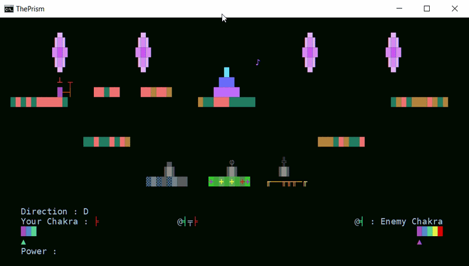
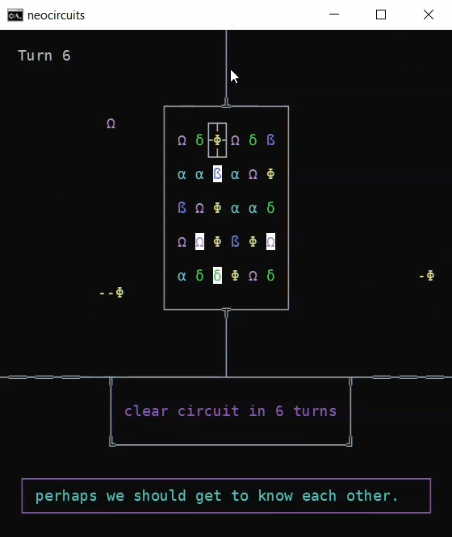
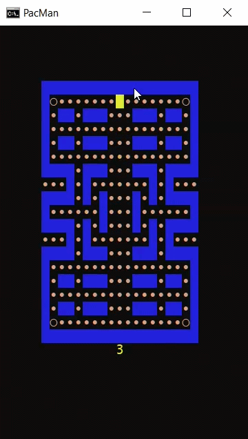
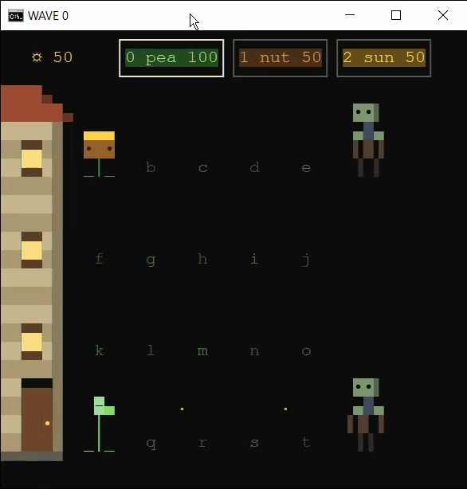
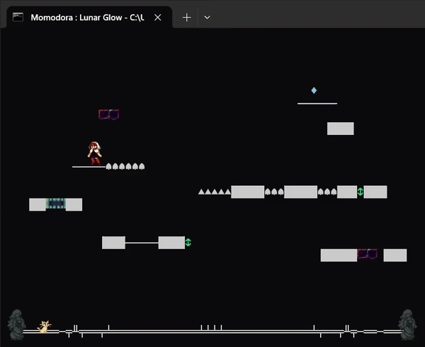

# How I make games in Batch Script

## Introduction
I've created many games in Batch Script in many genres like platformer games, puzzle games, clones of famous games, and in these tutorials I'm going to go over some techniques that I use to create them.




There are 3 main topics I want to cover:

* Multithreading: which gives us non blocking input, so you're not limited to turn based games
* VT100 escape sequences and Sixels: which gives us colorful graphics
* Music: which gives us audio in our games

## Multithreading

This tutorial will cover multithreading. Most games in Batch are turn based. This is because all the conventional ways of getting input, such as ```CHOICE``` or ```SET /P``` stop the program. That's fine for turn based games where nothing really happens in between turns. But how about something like Pacman. Without real time capabilities, that means the game only runs when you input something. The ghosts don't chase you until you move. So then how do I create programs such as this?




There's animations happening while I'm playing the game. The core idea is multithreading. We want two threads happening at once. One thread continually polls for user input from ```stdin```, and outputs it to ```stdout```. A game logic thread then reads that from it's ```stdin```. This other thread is non blocking, so things can happen in between inputs. A typical setup is to start two new threads like below. This program continually updates the window title from 1 to 3. While it does, you can enter A, B, C, or E to show the input on the console. Pressing E will quit the program. You many notice that you have to press one of the keys again to exit the script. There will be more on that in the [Quitting](#Quitting) section.

```Batch
@ECHO OFF
SETLOCAL ENABLEDELAYEDEXPANSION
IF NOT "%~1" == "" (
    GOTO :%~1
)
IF exist "%~dpn0.quit" (
    DEL /F /Q "%~dpn0.quit"
)
COPY NUL "%TEMP%\%~n0_signal.txt" >NUL

:MAIN
ECHO Press A, B, or C. Press E to exit.

"%~F0" CONTROL >"%TEMP%\%~n0_signal.txt" | "%~F0" GAME <"%TEMP%\%~n0_signal.txt"

ECHO Game End
EXIT /B

:GAME
FOR /L %%# in () DO (
    SET /P "input="
    IF defined input (
        ECHO You pressed !input!
        IF "!input!" == "E" (
            ECHO Press (E^) again to exit
            COPY NUL "%~dpn0.quit" >NUL
            EXIT
        )
        SET "input="
    )
    SET /A "number=(number + 1) %% 3"
    TITLE Number !number!
    
)

:CONTROL
FOR /L %%C in () DO (
    IF exist "%~dpn0.quit" (
        EXIT
    )
    FOR /F "tokens=*" %%A in ('CHOICE /C:ABCE /N') DO (
        <NUL SET /P ".=%%A"
    )
)
GOTO :EOF
```

The ```CONTROL``` thread is the ```INPUT```. The ```GAME```  thread is our game logic. The ```%~F0``` means we want to start the same Batch file but with ```CONTROL``` or ```GAME``` as an argument. At the start of the file we have this:

```Batch
IF not "%~1" == "" (
    GOTO :%~1
)
```

This means that if the first argument isn't empty, then we go to that label. So in this case, each of the threads go to ```CONTROL``` and ```GAME``` respectively. Technically this is just to keep the logic inside one file. One could also start separate files containing those threads as well.

You may also ask, why are we redirecting to a file if we are also using a pipe? Doesn't the ```stdout``` get redirected to a file?
The answer is that we want to block the main thread from exiting since we want to return to it afterward. Consider the situation where the game ends. For example, you want to go back to a menu. A pipe starts separate ```CMD``` processes for each of it's children in the same window, and since ```%~F0``` starts the batch file in the same process (Note: it does not return to the same process afterwards), using a pipe means that that whole command doesn't return until all the threads have exited. Thus, you can see from this example, we return to ```ECHO Game End``` and do whatever we want there.

An alternative setup is to use ```START /B``` and ```CMD /C```. ```START /B``` starts  a process in the same window but is non blocking. In this setup, the last thread has to be a blocking one to get the same blocking behaviour. Yet, in ```CONTROL``` we typically have an infinite ```FOR``` loop to get input. We need to use the ```EXIT``` command, but that also exits out of the whole window. So we need a blocking command that also starts a new process so we can ```EXIT``` out, which is ```CMD /C```. However, syntactically this is much uglier. Now, ```GAME``` and ```CONTROL``` are reversed. This actually depends on what sort of input method you're using. In the typical setup of using ```CHOICE```, I reverse it because ```CHOICE``` is blocking, so we need one more input to unblock it to ```EXIT``` so ```CONTROL``` is guaranteed to still be alive after ```GAME``` dies. Whichever process outlives the other has to be the one the parent blocks on, or else the ```MAIN``` process commands start executing.

```Batch
(START /B "" "%~F0" GAME <"%temp%\%~n0_signal.txt")
CMD /C ""%~F0" CONTROL >"%temp%\%~n0_signal.txt""
```

You may ask why are we redirecting the file and not just utilizing the pipe to read ```stdin```? The reason being is that if we do that, the game goes back to being turn based. Since ```SET /P``` is blocking. However if we redirect a file into it, ```SET /P``` becomes non blocking. ```SET /P``` reads the next unread line. Therefore, we redirect the ```CONTROL``` ```stdout``` into a file, and redirect that file as ```stdin``` into ```GAME```, so we can continuously read and input at the same time. However, in this structure, if you press keys faster than your game loop runs, you can miss player inputs.

## Variations

You can extend this technique to have an arbitrary number of threads. For example, I can ```START /B``` a ```RENDERER``` thread. 

```Batch
(START /B "" "%~F0" RENDERER) < "%TEMP%\%~n0_sig_render.txt"
"%~F0" CONTROL > "%TEMP%\%~n0_sig.txt" | "%~F0" GAME < "%TEMP%\%~n0_sig.txt" > "%TEMP%\%~n0_sig_render.txt"
```

The ```RENDERER``` thread reads ```stdin``` from a ```RENDERER``` file that ```GAME``` outputs to ```stdout```. In this way, we can separate the rendering logic (for example, sprite animations) into it's own separate thread, and only have ```GAME``` logic inside the ```GAME``` thread. See my Plants Vs Zombies implementation [here](https://github.com/thelowsunoverthemoon/Arcade.bat/blob/master/Scripts/PlantsVsZombies.bat).



Another example of using an auxiliary thread is if your game takes too many characters and you line goes over 8191 characters. This is very bad as it can just crash your process, so if you want to output some environment details for example, you can use a separate thread that outputs those. For example,

```Batch
START /B "" %0 RENDER_PROPS
"%~F0" CONTROL > "%TEMP%\%~n0_sig.txt" | "%~F0" MENU < "%TEMP%\%~n0_sig.txt"
```

You can see this in my platformer Momodora Lunar Glow [here](https://github.com/thelowsunoverthemoon/MomodoraLunarGlow/tree/main).



The bottom section of sprites (the cat and bottom border) are outputted using ```RENDER_PROPS```, or else it would go over the 8191 limit. These design choices are based on what sort of game you are writing and what performance you have seen. For example, with separate threads, you can cleanly separate logic, and  also potentially have less environment variables for each thread which can improve performance since since ```SET``` degrades over time with a  larger environment. On the other hand, starting more threads means more overhead overall and this also cause all the threads to slow down. So it's a balance based on what your game needs.

## Input Functions

Moving on to the actual input functions. Typically, you can use ```CHOICE```. You can also use ```XCOPY /W``` but that's a bit more complex. The pro of that method is that it can read a much wider range of characters since ```CHOICE``` only accepts these characters: a-z, A-Z, 0-9 and ASCII values of 128 to 254. For example, it can't capture spaces. Another advantage is that it won't have an annoying beep sound when you input a key that's not used in your game. ```CHOICE``` typically suits most needs. This is a pretty simple function:


```Batch
:CONTROL
FOR /L %%C in () DO (
    IF EXIST "%~dpn0.quit" (
        EXIT
    )
    FOR /F "tokens=*" %%A in ('CHOICE /C:ABCE /N') DO (
        <NUL SET /P ".=%%A"
    )
)
GOTO :EOF
```

We continually loop over the output of the ```CHOICE``` command. We'll get to that IF statement later but that's to quit the process once the game ends and return to ```MAIN```. And we use ```<NUL SET /P``` to get the input into ```stdout```. How ```XCOPY /W``` works is that the ```/W``` argument makes it take in one character, and outputs it in the same line. For example, here I ran the ```XCOPY /W``` command and I inputted letter ```a```:

```
Press any key when ready to begin copying file(s)a
```

Therefore we can read the last character to get the user input. Here is the equivalent function as above using ```XCOPY /W```. It is similar, but a bit more complex.

```Batch
:CONTROL
FOR /L %%C in () do (
    IF EXIST "%~dpn0.quit" (
        EXIT
    )
    FOR /F "delims=" %%A in ('XCOPY /W "%~F0" "%~F0" 2^>nul') DO (
        SET "key=%%A"
        SET "key=!key:~-1!"
        IF /I "!key!" == "A" (
            <NUL SET /P ".=A"
        ) else IF /I "!key!" == "B" (
            <NUL SET /P ".=B"
        ) else IF /I "!key!" == "C" (
            <NUL SET /P ".=C"
        ) else IF /I "!key!" == "E" (
            <NUL SET /P ".=E"
        )
    )
)
GOTO :EOF
```

Reading this is simple in the ```GAME``` process. Just use ```SET /P``` to read from ```stdin```.

```Batch
 FOR /L %%$ in () DO (
    SET /P "input="
    IF defined input (
        IF "!input!" == "A" (
            ECHO Pressed A
        )
        SET "input="
    )
)
```

The disadvantage of this is that ```CHOICE``` or ```XCOPY /W``` can only read one key at a time. If you need more than one key, an option is to use ```POWERSHELL```. For example:

```Powershell
SET $input=POWERSHELL ^
Add-Type -AssemblyName PresentationCore; ^
While ($true) { ^
    if ([System.IO.File]::Exists('%~dpn0.quit')) { ^
        Exit ^
    } ^
    $keys = ''; ^
    if ([System.Windows.Input.Keyboard]::IsKeyDown([System.Windows.Input.Key]::W)){ ^
        $keys += 'W' ^
    } ^
    if ([System.Windows.Input.Keyboard]::IsKeyDown([System.Windows.Input.Key]::A)){ ^
        $keys += 'A' ^
    } ^
    if ([System.Windows.Input.Keyboard]::IsKeyDown([System.Windows.Input.Key]::D)){ ^
        $keys += 'D' ^
    } ^
    if ($keys -ne '') { ^
        Write-Host $keys ^
    } ^
    Start-Sleep -Milliseconds 50 ^
}
%$input% > "%TEMP%\%~n0_sig.txt" | "%~F0" GAME < "%TEMP%\%~n0_sig.txt"
```

The caret syntax is a line continuation character, so it tells ```CMD``` that this is not the end of the line, and to read the next line as a continuation. So, with this method, you have to write the Powershell command as if it's just one line. But again, you don't have to do this, you can use a separate file. Just an aside, using the caret is very useful if you have for example a long ```SET /A```, you can easily separate it into readable chunks.

```Batch
SET /A "a=1",^
       "b=3",^
       "c=5"

```

While this means your program won't be pure Batch, and some environments block Powershell, this is a clean way to do multi character inputs. Using this logic, we can get combinations of inputs and parse it using string substitution for example.

```Batch
IF defined input (
    IF NOT "!input:A=!" == "!input!" (
        ECHO Contains A
    )
    SET "input="
)
```

## Quitting

Since there are multiple processes at once, we need all to close or they will keep running in the background. So we need a method to communicate with all the processes that the game ended. So we can create an empty "quit" file in ```GAME``` for example.

```Batch
COPY NUL "%~dpn0.quit" >NUL
```

And for all the processes if we detect it, then exit.

```Batch
IF exist "%~dpn0.quit" (
    EXIT
)
```

Make sure to delete this file at the start of your Batch file or the next time you run it the threads will end immediately. After it exits, we logically return back to the ```MAIN``` thread. Now there is an interesting hitch when you use a blocking function as your input method such as ```CHOICE``` or ```XCOPY /W```. Since those are blocking, that means even if we do create that file, you will be blocked at the command since the ```IF``` statement is gated by it. So you need the user to input one more input to exit (this doesn't apply to using a ```POWERSHELL``` loop I showed since it's non blocking).

An interesting, pure Batch way around this is to use query state sequences. First, switch to using ```XCOPY /W```. How this fixes the problem with ```CHOICE```, is that we can read the escape character. (Note: this is only supported on Windows 10 and above since VT100 escape sequences are supported there). ```CHOICE``` cannot read the escape character, but ```XCOPY``` can since it can read an arbitrary byte of input. So we can use the query state sequences to automatically output to ```stdin``` without needing user input. It outputs in the form ```ESC[<r>;<c>R``` so we can just read it in ```XCOPY```, then exit if we get it. There are also other solutions like using ```SendKeys``` by embedding VBScript if you really wanted to, but that's pretty ugly and this solution is quite clean in my opinion. Below is an example program that does the same title changing as before, but you can only need to press A once to exit back to ```MAIN```.

```Batch
@ECHO OFF
SETLOCAL ENABLEDELAYEDEXPANSION
FOR /F %%A in ('ECHO PROMPT $E^| CMD') DO SET "\e=%%A"
IF not "%~1" == "" (
    GOTO :%~1
)
IF exist "%~dpn0.quit" (
    DEL /F /Q "%~dpn0.quit"
)
COPY NUL "%TEMP%\%~n0_signal.txt" >NUL

:MAIN
ECHO Pres A to exit

"%~F0" CONTROL >"%temp%\%~n0_signal.txt" | "%~F0" GAME <"%temp%\%~n0_signal.txt"

ECHO No need to input extra key
PAUSE

EXIT /B

:GAME
FOR /L %%# in () DO (
    SET /P "input="
    IF "!input!" == "A" (
       <NUL SET /P "=%\e%[6n"
        EXIT 
    )
    SET "input="
    
    SET /A "number=(number + 1) %% 3"
    TITLE Number !number!
)

:CONTROL
FOR /L %%C in () do (
    IF EXIST "%~dpn0.quit" (
        EXIT
    )
    FOR /F "delims=" %%A in ('XCOPY /W "%~F0" "%~F0" 2^>nul') DO (
        SET "key=%%A"
        SET "key=!key:~-1!"
        IF /I "!key!" == "A" (
            <NUL SET /P ".=A"
        ) else IF "!key!" == "%\e%" (
            EXIT
        )
    )
)
GOTO :EOF
```

## Credits

Credits to dbenham for the original two process technique in his Snake game [here](https://archive.is/Y6hgZ). For more information about multithreading in Batch Script, see this [multithreading framework](https://www.dostips.com/forum/viewtopic.php?f=3&t=6601&p=63390#p63390) by Aacini, or my own implementations of parallel computation operations [here](https://github.com/thelowsunoverthemoon/loom).


